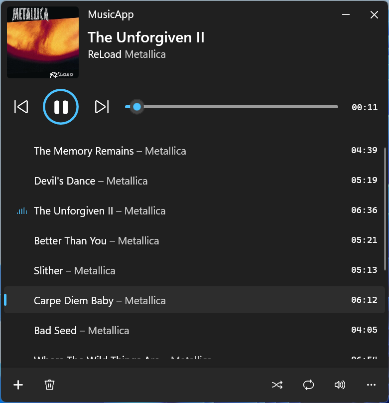

# MusicApp
A minimal music player built with C# and WinUI 3, featuring a clean and intuitive interface. Supports basic playback, track switching, and volume control.

The [preview build](https://github.com/albertakhmetov/MusicApp/releases/tag/v0.1.1-preview) is now available!

